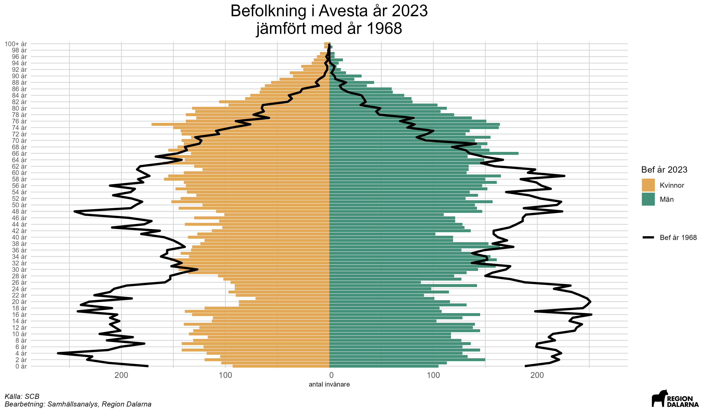

```{r setup, include=FALSE}
knitr::opts_chunk$set(echo = TRUE)
if (!require("pacman")) install.packages("pacman")
p_load(tidyverse)

```

# Introduktion {-}
I denna rapport presenteras befolkningsutvecklingen i Dalarnas län. Fokus ligger på att beskriva hur befolkningen har förändrats över tid, samt att ge en översikt av befolkningsutvecklingen i de olika kommunerna i länet.

dfdf

För mer info om statistiken, klicka på rutan nedan:

<details>
<summary>Mer information om statistiken</summary>

<div title="Källa: SCB">I folkmängden som SCB publicerar ingår personer som är folkbokförda i landet. För att den som flyttar till Sverige ska bli folkbokförd ska personen ha för avsikt och rätt att stanna i Sverige i minst ett år. För personer som inte är medborgare i ett EU-land innebär det att det krävs ett uppehållstillstånd som gäller minst 12 månader för att bli folkbokförd. Till följd av Rysslands invasion av Ukraina den 24 februari 2022 har Europeiska unionen (EU) beslutat att aktivera massflyktsdirektivet, vilket innebär att personer från Ukraina utan individuell prövning ska erbjudas tidsbegränsat uppehålls- och arbetstillstånd inom EU. Personer som får uppehållstillstånd enligt massflyktsdirektivet ska i regel inte bli folkbokförda och ingå i den officiella befolkningsstatistiken. Läs mer [här](https://www.scb.se/hitta-statistik/statistik-efter-amne/befolkning/befolkningens-sammansattning/befolkningsstatistik/produktrelaterat/Fordjupad-information/statistik-om-invandring---fragor-och-svar/){target="_blank"}.

Under 2023 inledde Skatteverket ett arbete med att avregistrera flera tusen folkbokförda personer som vid en granskning visat sig inte längre bo i Sverige. I folkbokföringen har dessa registrerats som utvandrade till okänt utvandringsland. Läs mer [här](https://www.scb.se/pressmeddelande/sverige-gar-mot-lagsta-befolkningsokningen-pa-manga-ar/){target="_blank"}.

För en större genomgång av hur folk och bostadsräkningar går till i Sverige, se SCBs genomgång [här](https://www.scb.se/hitta-statistik/statistik-efter-amne/befolkning/befolkningens-storlek-och-forandringar/registerbaserad-folk--och-bostadsrakning-census/produktrelaterat/Fordjupad-information/fragor-och-svar-om-folk--och-bostadsrakningar-census-med-mera/){target="_blank"}.

</div>
</details>

# Sammanfattning {-}


# Befolkningsutveckling

## Folkmängd

För att beskriva befolkningsutvecklingen över längre tidshorisonter används ofta den så kallade demografiska transitionsmodellen. Denna modell beskriver hur befolkningstillväxt och demografiska mönster förändras över tid när ett land utvecklas från ett förindustriellt till ett postindustriellt samhälle. Modellen är vanligtvis indelad i fyra eller fem faser, vilka beskrivs i informationsrutan nedan:

<details>
<summary>Den demografiska transitionsmodellen</summary>

* **Steg 1: Förindustriellt Stadium.**
I det första stadier har länder höga födelsetal och höga dödstal, vilket resulterar i en stabil men låg befolkningstillväxt. Många barn föds, men många dör i ung ålder på grund av sjukdomar, dålig medicinsk vård och svält. Detta steg representerar mycket av mänsklighetens historia fram till 1700-talet.
* **Steg 2: Tidigt Industrialisering Stadium.**
När medicinsk och hygienisk förbättring sker, börjar dödstalen sjunka. Detta leder till en snabb befolkningstillväxt då födelsetalen förblir höga. Många utvecklingsländer befinner sig i detta stadium idag, och historiskt inträffade detta i Europa under 1800-talet.
* **Steg 3: Sent Industrialisering Stadium.**
Ekonomisk utveckling, urbanisering och förändrade sociala normer leder till minskade födelsetal. Familjer börjar föredra färre barn på grund av förändrade ekonomiska och sociala förhållanden. Detta stadium kännetecknar Västeuropa och Nordamerika under 1900-talets början.
* **Steg 4: Postindustriellt Stadium.**
Både födelse- och dödstal stabiliseras på en låg nivå, vilket leder till en långsamt växande eller till och med minskande befolkning. Hög levnadsstandard och god medicinsk vård är kännetecken. Många utvecklade länder idag, inklusive Sverige.
* **Eventuellt Steg 5: Negativ Befolkningstillväxt.**
I vissa teorier inkluderas ett sista stadium där födelsetalen är så låga att befolkningen minskar, trots låga dödstal. Detta kan leda till en åldrande befolkning med färre unga människor. Några länder i Östeuropa och Japan upplever redan detta fenomen.

För en djupare genomgång, se exempelvis [Our World in Data](https://ourworldindata.org/demographic-transition){target="_blank"}.

</details>

I Sverige har folkmängden mätts sedan mitten av 1700-talet. Då befann sig Sverige, som hade ungefär 2 miljoner invånare, i ett förindustriellt stadium och präglades första hand av en agrar ekonomi, där befolkningen var beroende av jordbruket för sin försörjning. Under 1800-talet skedde en snabb urbanisering, där befolkningen flyttade från landsbygden till städerna. Detta möjliggjordes av den industriella revolutionen, som ledde till en ökad efterfrågan på arbetskraft i städerna. I mitten av 1800-talet hade Sveriges befolknings nästintill fördubblats till 3,9 miljoner invånare. Denna utveckling är typisk för det stadium som brukar benämnas tidig industrialisering. Under 1900-talet fortsatte befolkningen att växa och 2017 passerade Sverige 10 miljoner invånare (idag är befolkningen ungefär 10,5 miljoner). Sverige kan sägas befinna sig i ett postindustriellt stadium, där befolkningstillväxten är relativt låg och befolkningen åldras.

På länsnivå finns data över befolkningen från slutet av 1960-talet. I kartan nedan illustreras utvecklingen av befolkningen i Sveriges län mellan 1968 och `r unique(befolkning_forandring_lan$år)` och ett tydligt mönster framgår. Sveriges befolkning har i första hand ökat i de sydliga länen och då framförallt storstadsregioner. `r befolkning_forandring_lan %>% filter(förändring == max(.$förändring)) %>% .$region` har haft den snabbaste befolkningsutvecklingen, med en ökning på ungefär `r round(befolkning_forandring_lan %>% filter(förändring == max(.$förändring)) %>% .$förändring,0)` procent sedan 1968. Detta hänger sannolikt samman med den relativt närheten till Stockholm kombinerat med ett av Sveriges främsta lärosäten. Även Halland och Stockholms län har haft befolkningsökningar på över 70 procent under samma tidsperiod. I de nordligare delarna av landet är bilden relativt annorlunda. Med undantag för Västerbottens län, där befolkningen ökat med ca `r round(befolkning_forandring_lan %>% filter(region == "Västerbotten") %>% .$förändring,0)` procent sedan 1968, har befolkningen minskat i de län som utgör Norrland. Störst minskning har skett i `r befolkning_forandring_lan %>% filter(förändring == min(.$förändring)) %>% .$region`, där befolkningen minskat med ca `r round(abs(befolkning_forandring_lan %>% filter(förändring == min(.$förändring)) %>% .$förändring),0)` procent sedan 1968. I Dalarna har befolkningen ökat med ungefär `r round(befolkning_forandring_lan %>% filter(region == "Dalarna") %>% .$förändring,0)` procent sedan 60-talet, vilket är bättre än näraliggande län som Värmland och Gävleborg men sämre än exempelvis Örebro och Västmanland. Bidragande orsaker till detta är sannolikt avsaknad av större lärosäten och det relativt långa avståndet till storstadsregioner såsom Stockholm.

```{r, echo = FALSE, message = FALSE, warning = FALSE, fig.height=5, fig.width=8, fig.align='center'}
gg_kartor$karta_lan

```

På kommunnivå i Dalarna framträder ett liknande mönster, men i mindre skala. Befolkningen har ökat mest i `r befolkning_forandring_kommun %>% filter(förändring == max(.$förändring)) %>% .$region`, där den ökat med ungefär `r round(befolkning_forandring_kommun %>% filter(förändring == max(.$förändring)) %>% .$förändring,0)` procent sedan 1968. Även i Borlänge och näraliggande pendlingsorter som Säter och Gagnef har befolkningen ökat tydligt. I de nordligare delarna av länet har befolkningen ökat mest i Leksand och Mora. Dessa ökningar har skett på bekostnad av framförallt mindre kommuner i norra och västra Dalarna, där exempelvis Älvdalen och Vansbro har haft en befolkningsminskning på närmare 30 procent sedan 1968. I de södra delarna av länet är det framförallt tidigare bruksorter som Avesta och Ludvika som haft en kraftig befolkningsminskning (strax över 20 procent).

```{r, echo = FALSE, message = FALSE, warning = FALSE, fig.height=5, fig.width=8, fig.align='center'}
gg_kartor$karta_kommun

```

Om vi fokuserar på utvecklingen i Dalarnas län på årsbasis, är det tydligt att befolkningsförändringarna följer ett visst mönster, där perioder av tydliga befolkningsökningar följs av perioder av befolkningsminskningar. Exakt vad alla svängningar beror på kan vara svårt att veta, men uppenbart är i alla fall att den tydliga minskningen under 1990-talet hänger samman med den djupa ekonomiska kris som då drabbade Sverige och Dalarna. Mer än 10 000 personer netto lämnade länet under den andra hälften av 1990-talet. Sedan millennieskiftet har befolkningsutvecklingen varit mer stabil, med en ökning på ungefär `r format(plyr::round_any(befolkning_df %>% filter(region == "Dalarnas län",år>"1999",variabel == "Folkökning") %>% .$varde %>% sum(),100),big.mark = " ")` personer under 2000-talet. En viktig anledning till denna ökning är flyktingkrisen 2016, när Dalarnas län tog emot många flyktingar. Under `r max(befolkning_df$år)` minskade befolkningen i Dalarna med närmare `r abs(plyr::round_any(befolkning_df %>% filter(år == max(år),variabel == "Folkökning",region == "Dalarnas län") %>% .$varde,100))` personer, vilket är den största minskningen sedan 2001. 


```{r, echo = FALSE, message = FALSE, warning = FALSE, fig.height=5, fig.width=8, fig.align='center'}
gg_befolkning$Befolkningsutveckling_Dalarna_ar_1968_2023
```

## Åldersstruktur

Även om folkmängden i Dalarna idag är ungefär lika stor som den var i slutet av 60-talet, är dess sammansättning väsentligt annorlunda, framförallt när det kommer till åldersfördelningen. Från slutet av andra Världskriget fram till mitten av 1960-talets föddes många barn i Sverige, vilka brukar sägas tillhöra generationen "baby-boomers". Detta syns tydligt i diagrammet nedan, då andelen av befolkningen som var under 30 år var klart högre 1968 än idag. I början av 1990-talet fick många "baby-boomers" barn, vilka idag är runt 30 år gamla. Till följd av detta är personer i den åldersgruppen klart fler idag än de var på 1960-talet. I diagrammet framgår även att andelen av befolkningen som är 65 år eller äldre har ökat kraftigt sedan 1968. Detta hänger samman med att "baby-boomers" börjar nå pensionsåldern, samtidigt som den förväntade livslängden i samhället stadigt ökat över tid. 

```{r, echo = FALSE, message = FALSE, warning = FALSE, fig.height=5, fig.width=8, fig.align='center'}

# include png file
knitr::include_graphics("Figurer/Befpyramid Dalarnas län 2023_jmfr_ar_1968.png")

```

I fortsättningen av denna rapport delas Dalarnas befolkningsutveckling upp i dess komponenter, födelsenetto, dvs. nettot av födda och döda, och flyttnetto, dvs. nettot av inrikes och utrikes flyttar. Vi börjar med födelsenettot.

# Födelsenetto

## Fruktsamhet
Antalet födda barn per kvinna i Sverige, den så kallade fruktsamheten, var under 2023 den lägsta som uppmätts (SCB har data sedan mitten av 1700-talet), vilket är i linje med utvecklingen i stora delar av västvärlden ([SCB](https://www.scb.se/pressmeddelande/historiskt-lagt-barnafodande-och-lagsta-folkokningen-pa-22-ar/){target="_blank"}). Som synes i diagrammet nedan tenderar dock fruktsamheten att variera relativt mycket över tid. Detta kan förklaras med en blandning av faktorer, såsom ekonomiska förhållanden, politiska beslut och kulturella normer. Under 1970-talet sjönk fruktsamheten i Sverige till följd av bland annat en ökad användning av preventivmedel och en ökad andel kvinnor som studerade och arbetade. Under 1980-talet togs diverse politiska beslut kopplade till att förbättra fruktsamheten (exempelvis generös föräldraförsäkring), vilket fick en positivt effekt fram till början av 1990-talet, innan en ekonomisk kris fick en tydligt negativ effekt. Under delar av 2000-talet har fruktsamheten varit relativt hög, vilket sannolikt hänger ihop med att den utrikes födda andelen av Sveriges befolkning då ökade kraftigt (invandrare har generellt högre födelsetal). 

Fruktsamheten i Dalarna följer i praktiken samma mönster som fruktsamheten i Sverige, men är något högre.

```{r, echo = FALSE, message = FALSE, warning = FALSE, fig.height=5, fig.width=8, fig.align='center'}
gg_fruktsamhet$summerad_fruktsamhet_Riket_facet__ar_1968_2023

```

Bland Dalarnas kommuner hade `r fruktsamhet_df %>% filter(år ==max(år)) %>% filter(sum_frukts_ar == max(sum_frukts_ar)) %>% .$region` år `r max(fruktsamhet_df$år)` den högsta fruktsamheten (`r sub("\\.",",",fruktsamhet_df %>% filter(år ==max(år)) %>% filter(sum_frukts_ar == max(sum_frukts_ar)) %>% .$sum_frukts_ar)`), medan `r fruktsamhet_df %>% filter(år ==max(år)) %>% filter(sum_frukts_ar == min(sum_frukts_ar)) %>% .$region` hade den lägsta (`r gsub("\\.",",",fruktsamhet_df %>% filter(år ==max(år)) %>% filter(sum_frukts_ar == min(sum_frukts_ar)) %>% .$sum_frukts_ar)`). Det är dock viktigt att notera att fruktsamheten på kommun-nivå kan variera relativt mycket över tid (se avsnittet kommunfördjupningar).

```{r, echo = FALSE, message = FALSE, warning = FALSE, fig.height=5, fig.width=8, fig.align='center'}

gg_fruktsamhet_kommun$jmf_summerad_fruktsamhet_ar_2023_Dalarna_ar

```

## Nettot mellan födda och döda

Under `r max(fodda_doda_df$år)` avled `r format(fodda_doda_df %>% filter(år == max(år)) %>% filter(region == "Dalarnas län",variabel == "Döda") %>% .$varde,big.mark = " ")` personer i Dalarna, vilket är en ökning jämfört med åren innan (med undantag för pandemiåret 2020). Detta till trots, går utvecklingen i länet mot att människor lever allt längre. I slutet av 1960-talet dog runt 3 300 personer i Dalarna, vilket är ungefär lika många som idag, trots att befolkningen då hade en annan ålderstruktur med en betydligt större andel unga (se avsnittet om åldersstruktur ovan). En viktig förklaring till detta är att den förväntade livslängden ökat kraftigt över tid, från 72 år för män och 77 år för kvinnor år 1970 till ungefär 82 år för män och 85 år för kvinnor ([SCB](https://www.scb.se/hitta-statistik/statistik-efter-amne/befolkning/befolkningsframskrivningar/befolkningsframskrivningar/pong/tabell-och-diagram/aterstaende-medellivslangd-vid-fodelsen-och-vid-65-ar-efter-kon-samt-framskrivning/){target="_blank"}) idag. Detta kan förklaras med att att sjukvården blivit bättre, att levnadsstandarden ökat och att människor idag lever hälsosammare liv.

Även när det gäller antalet födslar är trenden negativ. Under vissa år i början av 1990-talet föddes över 4 000 barn i Dalarna, men därefter skedde en dramatisk nedgång, vilket sannolikt hör samman med 90-talskrisen (se även avsnittet om fruktsamhet ovan). Under 2000-talet skedde en gradvis ökning av antalet födda fram till åren runt flyktingkrisen 2016. Därefter har födslarna återigen börjat minska och år `r max(fodda_doda_df$år)` föddes `r format(fodda_doda_df %>% filter(år == max(år)) %>% filter(region == "Dalarnas län",variabel == "födda") %>% .$varde,big.mark = " ")` barn i Dalarna, den lägsta siffran sedan 2001.

Sammantaget har nettot mellan födda och döda, se de svarta linjerna i diagrammet nedan, varit negativt i Dalarna under varje år sedan början av 1990-talet. Hur många invånare som länet tappar på grund av det varierar relativt mycket mellan åren, men under 2023 minskade befolkningen med `r abs(fodda_doda_df %>% filter(år == max(år),variabel == "netto",region == "Dalarnas län") %>% .$varde)` personer till följd av ett negativt födelsenetto, vilket är lägre än åren innan.

```{r, echo = FALSE, message = FALSE, warning = FALSE, fig.height=5, fig.width=8, fig.align='center'}
gg_fodda_doda$Födelsenetto_Dalarna_ar_1968_2023

```

Finns inget diagram för detta för tillfället.


Döda bör kopplat till åldersstrukturen, dvs. att trots att befolkningen idag är såväl större som har en annan ålderstruktur, så dog lika många 1968.

https://www.scb.se/hitta-statistik/statistik-efter-amne/befolkning/befolkningsframskrivningar/demografisk-analys/pong/statistiknyhet/kohortdodligheten-i-sverige.-dodlighetsutvecklingen-fram-till-2019

https://www.scb.se/contentassets/c77fa5ab928d4397b7d0a649c3f415db/be0701_1861i19_br_be51br2004.pdf

https://www.scb.se/hitta-statistik/statistik-efter-amne/befolkning/befolkningsframskrivningar/demografisk-analys/pong/statistiknyhet/aterstaende-medellivslangd-efter-utbildningsniva3/


# Flyttnetto

Som vi såg i avsnittet ovan, bidrar nettot mellan födda och döda i praktiken alltid negativt till Dalarnas befolkningsutveckling. Eftersom andelen av befolkningen som inte är i barnafödande ålder med all sannolikhet kommer att öka i framtiden, är det svårt att se hur den utvecklingen skall kunna förändras framöver. Om tanken är att Dalarnas befolkning skall växa blir det därför helt centralt att fler flyttar till länet än de som flyttar därifrån. Flyttarna till och från Dalarna kan delas upp i två delar:

* **Inrikes flyttar**, dvs. de som flyttar till och från länet från andra delar av Sverige.
* **Utrikes flyttar**, dvs de som flyttar till och från länet från andra delar av världen (in- och utvandring).


### Inrikes flyttningar

Generellt flyttar personer inrikes i första hand till större städer och universitetsorter. Detta hänger sannolikt samman med att dessa orter har en stor arbetsmarknad och goda utbildningsmöjligheter. I förhållande till sin befolkningsstorlek sticker Västerbotten, som har ungefär lika många invånare som Dalarna, ut. Den stora inflyttningen till länet är i första hand kopplat till Skellefteå, där befolkningen ökade med mer än 2000 personer under 2023, vilket i första hand beror på en stor industrisatsning (etablering av en batterifabrik). Anmärkningsvärt är även att den det inrikes flyttnettot till Stockholms län var negativt under 2023, vilket är i linje med en trend de senaste åren. En viktig förklaring till det är sannolikt att den stora gruppen födda i början av 1990-talet börjar komma upp i 30-årsåldern och då väljer att flytta från Stockholm till mindre städer. I Dalarna var det inrikes flyttnettot negativt och ungefär i linje med flera andra regioner med liknande befolkningsstorlek.


```{r, echo = FALSE, message = FALSE, warning = FALSE, fig.height=5, fig.width=8, fig.align='center'}
gg_flytt_lan$inrikes_flyttningsoverskott
```

Att det inrikes flyttnettot i Dalarna var negativt under 2023 är inget unikt. Sedan slutet av 1990-talet har har det inrikes flyttnettot varit negativt i Dalarna i en överväldigande majoritet av åren. En viktig förklaring till detta är sannolikt att befolkningen i Sverige blir mer urbaniserad, vilket innebär att allt fler flyttar från mindre län till storstadsregioner. I Dalarna är det framförallt unga personer som flyttar, vilket hänger samman med att det är i första hand unga personer som flyttar för att studera och arbeta. Mer om detta senare.

```{r, echo = FALSE, message = FALSE, warning = FALSE, fig.height=5, fig.width=8, fig.align='center'}
gg_flytt$`Inrikes flyttningsöverskott_Dalarna_ar_1997_2023`
```

SKALL LÄGGA IN TVÅ DIAGRAM MED FLYTTNINGAR TILL RESPEKTIVE FRÅN DALARNA
https://www.statistikdatabasen.scb.se/pxweb/sv/ssd/START__BE__BE0101__BE0101J/InOmflytt/table/tableViewLayout1/

### Utrikes flyttningar

Trots att såväl det inrikes flyttnettot som födelsenettot i normala fall är negativa i Dalarna, har befolkningen i länet ökat med runt `r format(plyr::round_any(befolkning_df %>% filter(region == "Dalarnas län",år>"1999",variabel == "Folkökning") %>% .$varde %>% sum(),100),big.mark = " ")` personer sedan millennieskiftet. Detta beror på att den sista komponenten som styr befolkningsutvecklingen, det utrikes flyttnettot, har varit positivt.  Framförallt invandrade många till Dalarna i samband med flyktingkrisen 2016, då mer än 4000 personer netto flyttade till länet från utlandet. Sedan dessa har invandringen dock minskat avsevärt och under 2023 var det utrikes flyttnettot i Dalarna blott `r flytt_overskott %>% filter(år=="2023", region=="Dalarnas län",variabel == "Invandringsöverskott") %>% .$varde` personer. Det anmärkningsvärt låga nettot kan delvis förklaras av att Skatteverket under 2023 inledde ett arbete med att avregistrera tusentals folkbokförda personer som vid en granskning visat sig inte längre bo i Sverige. I Dalarna ökade utvandringen under 2023 med ungefär 600 personer jämfört med åren innan, vilket sannolikt går att härröra till avregistreringar. Den främsta anledningen till det låga invandringsöverskottet på senare år är dock en striktare immigrationspolitik. Mellan 2020 och 2023 invandrade mellan 1400 och 1600 personer till Dalarna årligen, att jämföra med mellan 2000 och 3000 personer årligen åren dessförinnan. 

```{r, echo = FALSE, message = FALSE, warning = FALSE, fig.height=5, fig.width=8, fig.align='center'}
gg_flytt$Invandringsöverskott_Dalarna_ar_1997_2023

```


### Flytnetto

Sammantaget har Dalarnas län haft ett positivt flyttnetto under de flesta åren sedan millennieskiftet, vilket förklarar varför befolkningen ökat. Under 2023 var dock flyttnettot i Dalarna tydligt negativt (den största minskningen sedan 2000). Det negativa flyttnettot hänger samman med att det inrikes flyttnettot var negativt och att det utrikes flyttnettot minskade, vilket diskuterades i föregående avsnitt. 

```{r, echo = FALSE, message = FALSE, warning = FALSE, fig.height=5, fig.width=8, fig.align='center'}
gg_flytt$Flyttnetto_Dalarna_ar_1997_2023

```

För att fördjupa förståelsen kring vilka som flyttar till och från Dalarna delar vi i nästkommande avsnitt upp dessa utefter ålder och bakgrund (inrikes och utrikes födda).

### Åldersfördelning

Normalt är personer mest benägna att flytta till en annan ort när de är i 20-års åldern, innan flyttandet gradvis avtar. Detta hänger samman med att det i första hand är unga personer som flyttar för att studera och arbeta. I Dalarna är det framförallt unga personer som flyttar från länet (netto), vilket hänger samman med att länets arbetsmarknad är liten i jämförelse med många större regioner och att Högskolan Dalarna har relativt få studenter. Totalt minskade befolkningen i Dalarna med `r sum(flytt_aldersgrupper_df %>% filter(variabel == "Inrikes flyttningsöverskott",år == max(år),region == "Dalarnas län",alder_grupper %in% c("-19 år","20-29 år")) %>% .$varde) ` personer under `r max(flytt_aldersgrupper_df$år)` till följd av att personer under 30 flyttade till andra län (netto). Detta var en tydlig ökning jämfört med åren dessförinnan.

I samtliga andra åldergrupper i diagrammet nedan var nettoflyttningen inrikes positiv under `r max(flytt_aldersgrupper_df$år)`. Den största inflyttningen skedde i åldergruppen `r flytt_aldersgrupper_df %>% filter(variabel == "Inrikes flyttningsöverskott",år == max(år),region == "Dalarnas län") %>% filter(varde == max(varde)) %>% .$alder_grupper`, inom vilken `r flytt_aldersgrupper_df %>% filter(variabel == "Inrikes flyttningsöverskott",år == max(år),region == "Dalarnas län") %>% filter(varde == max(varde)) %>% .$varde` personer flyttade till Dalarna netto. Grovhugget kan Dalarna sägas vara ett län som unga flyttar ifrån för att söka jobb eller börja studera på annan ort, innan vissa i 30 årsåldern återvänder till länet för att bilda familj.

```{r, echo = FALSE, message = FALSE, warning = FALSE, fig.height=5, fig.width=8, fig.align='center'}
gg_flytt_alder$Inrikes_flyttnetto_alder_Dalarna_ar_2021_2023

```

Att unga flyttar från Dalarna är inget unikt för senare år. I åldersgruppen 20-29 år har det inrikes flyttnettot varit negativt i Dalarna under samtliga år sedan åtminstone 1997.

```{r, echo = FALSE, message = FALSE, warning = FALSE, fig.height=5, fig.width=8, fig.align='center'}
gg_flytt_alder$`Inrikes flyttnetto_alder_Dalarna_ar_1997_2023`

```

### Bakgrund

För att ytterligare förtydliga vilka som flyttar till och från Dalarna inrikes, delas de i detta avsnitt upp efter sin bakgrund, inrikes eller utrikes födda. 

Tydligt är att många av de som invandrade till länet i samband med flyktingkrisen 2015-2016 har flyttat därifrån sedan dess. Totalt har `r sum(flytt_bakgrund_df %>% filter(region == "Dalarna",år>2016,födelseregion == "Utrikes född") %>% .$Inrikes_flyttnetto)` utrikes födda flyttat från Dalarna till andra län sedan 2017. För inrikes födda är bilden annorlunda.Under samma tidsperiod flyttade `r sum(flytt_bakgrund_df %>% filter(region == "Dalarna",år>2016,födelseregion == "Född i Sverige") %>% .$Inrikes_flyttnetto)` personer födda i Sverige till Dalarna. Inflyttningen skedde dock framförallt under 2020-2022, vilket kan vara en effekt av Corona-pandemin. Under `r max(flytt_bakgrund_df$år)` flyttade `r abs(flytt_bakgrund_df %>% filter(region == "Dalarna",år == max(år),födelseregion == "Född i Sverige") %>% .$Inrikes_flyttnetto)` personer födda i Sverige från Dalarna till andra län netto, vilket är den lägsta siffran sedan 2015.

```{r, echo = FALSE, message = FALSE, warning = FALSE, fig.height=5, fig.width=8, fig.align='center'}
gg_flytt_bakgrund$Flyttnetto_bakgrundDalarna_ar2002_2023
```

Sammanfattningsvis minskade Dalarnas folkmängd under `r max(befolkning_df$år)` med `r befolkning_df %>% filter(år == max(år),region == "Dalarnas län",variabel == "Folkökning") %>% .$varde` personer, vilket är den största minskningen på mer än 20 år. Detta hänger samman med att mer eller mindre alla komponenter som förklar befolkningsutvecklingen försämrades jämfört med året innan.

I nästa avsnitt lämnar vi historiken och blickar framåt. Hur kommer Dalarnas folkmängd att utvecklas fram till 2040?

# Prognos

SCB gör vartannat eller vart tredje år prognoser för befolkningsutvecklingen på såväl läns som kommunal nivå. De senaste av dessa prognoser släpptes i juni 2024 och sträcker sig ända fram till 2070. Eftersom prognoser blir osäkrare desto längre fram i tiden de sträcker sig, kommer vi i detta avsnitt enbart fokusera på prognosen fram till 2040.

För en djupare förståelse runt hur SCB gör sina befolkningsprognoser, se informationsrutan nedan. Det viktigaste att ta med sig är att ingen hänsyn tas  till planerat bostadsbyggande, företagsetableringar eller andra framtida mål och förutsättningar i kommunerna i prognosen .

<details>
<summary>SCB:s Befolkningsprognoser</summary>

<div title="Källa: SCB">Den framtida befolkningens storlek och sammansättning bestäms av antaganden om den framtida utvecklingen av fruktsamhet, dödlighet och flyttningsmönster. Beräkningarna bygger på vad som observerats under de senaste nio åren och ett antagande om att den utvecklingen fortsätter. I beräkningarna tas ingen hänsyn till planerat bostadsbyggande, företagsetableringar eller andra framtida mål och förutsättningar i kommunerna.

De regionala befolkningsframskrivningarna överensstämmer med framskrivningen för riket.

Både små och stora strukturförändringar i samhället påverkar den framtida befolkningsutvecklingen, vilket innebär att det finns en osäkerhet förenad med framskrivningen. Notera att befolkningsframskrivningen endast ger en uppskattning av hur en framtida befolkning kan komma att se ut. Generellt gäller att osäkerheten i framskrivningen ökar med åren.
</div>

</details>

I diagrammet nedan visas befolkningsutvecklingen i Dalarna fram till 2040 enligt SCB:s senaste prognos, uppdelat på åldersgrupper. Ett par tydliga trender kan utläsas i diagrammet. 

För det första prognostiseras Dalarnas befolkning att minska med drygt `r abs(plyr::round_any(befprognos_df %>% filter(alder_grupp == "Totalt") %>% .$Folkmängd,100))` personer fram till 2040, vilket är en tydlig försämring jämfört med tidigare prognoser. I den föregående prognosen, som släpptes 2022, prognostiserades en minskning på under 1000 personer (se [SCB](https://www.statistikdatabasen.scb.se/pxweb/sv/ssd/START__BE__BE0401__BE0401B/BefProgRegFakN22/table/tableViewLayout1/){target="_blank"}).

För det andra är det framförallt i åldergruppen 0-19 år som befolkningen prognostiseras minska, med ungefär `r abs(plyr::round_any(befprognos_df %>% filter(alder_grupp == "0-19 år") %>% .$Folkmängd,100))` personer. Detta hänger sannolikt samman med att fruktsamheten minskat tydligt de senaste åren. Av Sveriges 21 län är det bara i Uppsala som antalet personer under 25 väntas öka fram till 2040 ([SCB](https://www.scb.se/hitta-statistik/statistik-efter-amne/befolkning/befolkningsframskrivningar/befolkningsframskrivningar/pong/statistiknyhet/den-framtida-befolkningen-i-sveriges-lan-och-kommuner-20242040/){target="_blank"}).

Vidare är det framförallt bland äldre som befolkningen prognostiseras öka i framtiden. I åldergruppen 80+ prognostiseras befolkning att öka med ungefär `r abs(plyr::round_any(befprognos_df %>% filter(alder_grupp == "80+ år") %>% .$Folkmängd,100))` fram till 2040, vilket är ungefär i linje med tidigare prognoser. Detta hänger sannolikt samman med att den förväntade livslängden fortsätter öka och att den stora gruppen födda från andra världskrigets slut fram till början av 1960-talet börjar komma upp i 80-års åldern.

Värt att notera är även att befolkningen i den åldersgrupp som brukar benämnas arbetsför ålder, 20-64 år, förväntas minska tydligt fram till 2040. 

Sammantaget ger SCB:s prognosen en hint om stora utmaningar för Dalarna framöver. Befolkningen blir äldre och minskar i antal, vilket sätter press på såväl välfärden som arbetsmarknaden. Hur Dalarna möter dessa utmaningar blir en avgörande faktor för länets framtida utveckling.

```{r, echo = FALSE, message = FALSE, warning = FALSE, fig.height=5, fig.width=8, fig.align='center'}
gg_befprognos$befolkningsforandring_Dalarna_2023_2040
```

# Kommunfördjupningar {.tabset .tabset-fade .tabset-pills}

## Avesta {-}

I likhet med de flesta kommuner i Dalarna har Avestas befolkning minskat under en lång period, från ca `r format(plyr::round_any(befolkning_df %>% filter(år == min(år),region == "Avesta" ,variabel == "Folkmängd") %>% .$varde,100),big.mark=" ") ` invånare  år `r min(befolkning_df$år)` till ungefär `r format(plyr::round_any(befolkning_df %>% filter(år == max(år),region == "Avesta", variabel == "Folkmängd") %>% .$varde,100),big.mark=" ") ` invånare år `r max(befolkning_df$år)`.

Befolkningen minskar under en överväldigande majoritet av åren, vilket syns tydligt i diagrammet nedan. Det stora undantaget var i samband med flyktingkrisen 2015-2016, när Avestas befolkning ökade med mer än 1100 personer. Därefter minskade befolkningen under några år, vilket till stor del kan förklaras med att personer som flyttade till Avesta i samband med flyktingkrisen lämnade för andra delar av Sverige. Under 2022 ökade Avestas befolkning något (`r befolkning_df %>% filter(år == "2022",region == "Avesta", variabel == "Folkökning") %>% .$varde ` personer), men denna ökning följdes av en en betydligt större minskning 2023 (`r befolkning_df %>% filter(år == "2023",region == "Avesta", variabel == "Folkökning") %>% .$varde ` personer).

```{r, echo = FALSE, message = FALSE, warning = FALSE, fig.height=5, fig.width=8, fig.align='center'}
gg_befolkning$Befolkningsutveckling_Avesta_ar_1968_2023
```


```{r, echo = FALSE, message = FALSE, warning = FALSE, fig.height=5, fig.width=8, fig.align='center'}
gg_fruktsamhet_kommun$summerad_fruktsamhet_Avesta_facet__ar_1968_2023
```

```{r, echo = FALSE, message = FALSE, warning = FALSE, fig.height=5, fig.width=8, fig.align='center'}
gg_fodda_doda$Födelsenetto_Avesta_ar_1968_2023
```

```{r, echo = FALSE, message = FALSE, warning = FALSE, fig.height=5, fig.width=8, fig.align='center'}

```

```{r, echo = FALSE, message = FALSE, warning = FALSE, fig.height=5, fig.width=8, fig.align='center'}
gg_flytt$Flyttnetto_Avesta_ar_1997_2023

```

```{r, echo = FALSE, message = FALSE, warning = FALSE, fig.height=5, fig.width=8, fig.align='center'}
gg_flytt$`Inrikes flyttningsöverskott_Avesta_ar_1997_2023`
```

```{r, echo = FALSE, message = FALSE, warning = FALSE, fig.height=5, fig.width=8, fig.align='center'}
gg_flytt$Invandringsöverskott_Avesta_ar_1997_2023
```

```{r, echo = FALSE, message = FALSE, warning = FALSE, fig.height=5, fig.width=8, fig.align='center'}
gg_flytt_alder$Inrikes_flyttnetto_alder_Avesta_ar_2021_2023
```

```{r, echo = FALSE, message = FALSE, warning = FALSE, fig.height=5, fig.width=8, fig.align='center'}
gg_flytt_alder$`Inrikes flyttnetto_alder_Avesta_ar_1997_2023`
```

```{r, echo = FALSE, message = FALSE, warning = FALSE, fig.height=5, fig.width=8, fig.align='center'}
gg_flytt_bakgrund$Flyttnetto_bakgrundAvesta_ar2002_2023

```

## Borlänge {-}

## Falun {-}

## Gagnef {-}

## Hedemora {-}

## Leksand {-}

## Ludvika {-}

## Malung-Sälen {-}

## Mora {-}

## Orsa {-}

## Rättvik {-}

## Smedjebacken {-}

## Säter {-}

## Vansbro {-}

## Älvdalen {-}


