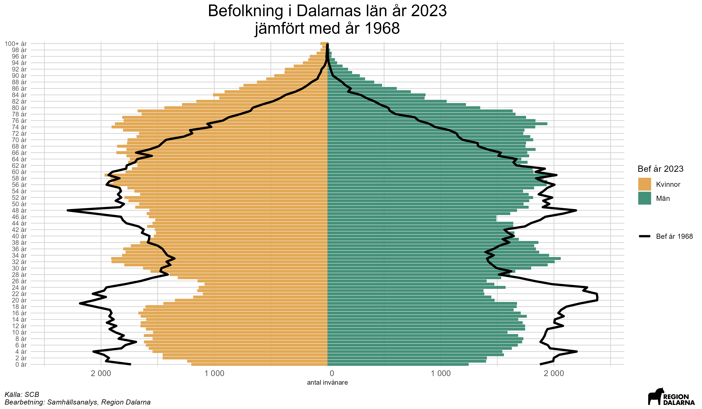

```{r setup, include=FALSE}
knitr::opts_chunk$set(echo = TRUE)
if (!require("pacman")) install.packages("pacman")
p_load(tidyverse)

```

# Sammanfattning {-}
* Minskningen i Dalarnas folkmängd år 2023, jämfört med åren innan, beror på en svagare utveckling inom mer eller mindre alla komponenter som förklarar befolkningsutvecklingen.
* Det föddes klart färre barn i Dalarna 2023 jämfört med åren innan. Detta är i linje med en större trend i samhället, då barnafödandet per kvinna i Sverige 2023 var det lägsta som har uppmätts.
* En allt stramare migrationspolitik gör att färre invandrar till Sverige än tidigare, vilket även påverkar inflyttningen till Dalarna.
* Många, framförallt unga vuxna födda utanför Sverige, flyttade från Dalarna till andra delar av Sverige under 2023.
* Enligt den senaste befolkningsprognosen från SCB (juni 2024) förväntas den negativa trenden i Dalarnas befolkningsutveckling fortsätta även i framtiden. Befolkningen minskar framförallt i yngre åldersgrupper, medan antalet äldre invånare förväntas öka avsevärt.

# Introduktion {-}
Hur folkmängden förändras över tid är en central fråga för såväl samhällsplanering som politik. Befolkningsutvecklingen påverkar allt från bostadsmarknaden och arbetsmarknaden till skatteintäkter och välfärdssystem. Västvärlden i stort står inför en rad demografiska utmaningar, såsom en åldrande befolkning och minskande barnafödande. I Sverige var exempelvis barnafödandet per kvinna under 2023 det lägsta som uppmätts. 

Med utgångspunkt i den typen av trender, analyseras i denna rapport befolkningsutvecklingen i Dalarnas län med fokus på hur folkmängden har förändrats över tid. Genom att undersöka faktorer som födelsetal, dödstal, in- och utvandring, samt flyttmönster, presenteras en bild av de demografiska trenderna i länet. Rapporten ger också en översikt av utvecklingen i länets kommuner.

För mer information om den statistik som rapporten bygger på, klicka nedan:

<details>
<summary>Mer information om statistiken</summary>

<div title="Källa: SCB">I folkmängden räknas endast personer som är folkbokförda i landet. För att den som flyttar till Sverige ska bli folkbokförd ska personen ha för avsikt och rätt att stanna i Sverige i minst ett år. För personer som inte är medborgare i ett EU-land innebär det att det krävs ett uppehållstillstånd som gäller minst 12 månader för att bli folkbokförd. 

Till följd av Rysslands invasion av Ukraina den 24 februari 2022 har Europeiska unionen (EU) beslutat att aktivera massflyktsdirektivet, vilket innebär att personer från Ukraina utan individuell prövning ska erbjudas tidsbegränsat uppehålls- och arbetstillstånd inom EU. Personer som får uppehållstillstånd enligt massflyktsdirektivet ska i regel inte bli folkbokförda och ingår därmed inte i den officiella befolkningsstatistiken. Läs mer [här](https://www.scb.se/hitta-statistik/statistik-efter-amne/befolkning/befolkningens-sammansattning/befolkningsstatistik/produktrelaterat/Fordjupad-information/statistik-om-invandring---fragor-och-svar/){target="_blank"}.

Under 2023 inledde Skatteverket ett arbete med att granska registret över folkbokförda. Det förde med sig att SCB avregistrerade flera tusen folkbokförda personer som visade sig inte längre bo i Sverige. I folkbokföringen har dessa registrerats som utvandrade till okänt utvandringsland. Läs mer [här](https://www.scb.se/pressmeddelande/sverige-gar-mot-lagsta-befolkningsokningen-pa-manga-ar/){target="_blank"}. I Dalarna avregistrerades 192 personer under 2023.

För en större genomgång av hur folk- och bostadsräkningar går till i Sverige, se SCBs genomgång [här](https://www.scb.se/hitta-statistik/statistik-efter-amne/befolkning/befolkningens-storlek-och-forandringar/registerbaserad-folk--och-bostadsrakning-census/produktrelaterat/Fordjupad-information/fragor-och-svar-om-folk--och-bostadsrakningar-census-med-mera/){target="_blank"}.

</div>
</details>

# Befolkningsutveckling

## Folkmängd

För att beskriva befolkningsutvecklingen över längre tidshorisonter används ofta den så kallade demografiska transitionsmodellen. Denna modell beskriver hur befolkningstillväxt och demografiska mönster förändras över tid när ett land utvecklas från ett förindustriellt till ett postindustriellt samhälle. Modellen är vanligtvis indelad i fyra eller fem faser, vilka beskrivs i informationsrutan nedan:

<details>
<summary>Den demografiska transitionsmodellen</summary>

* **Steg 1: Förindustriellt stadium.**
I det första stadiet har länder höga födelsetal och höga dödstal, vilket resulterar i en stabil men låg befolkningstillväxt. Många barn föds, men många dör också i ung ålder på grund av sjukdomar, dålig medicinsk vård och svält. Detta steg representerar en stor del av mänsklighetens historia fram till 1700-talet.
* **Steg 2: Tidig industrialiseringsstadium.**
När medicinsk och hygienisk förbättring sker börjar dödstalen sjunka. Detta leder till en snabb befolkningstillväxt då födelsetalen förblir höga. Många utvecklingsländer befinner sig i detta stadium idag, och historiskt inträffade detta i Europa under 1800-talet.
* **Steg 3: Sen industrialiseringsstadium.**
Ekonomisk utveckling, urbanisering och förändrade sociala normer leder till minskande födelsetal. Familjer börjar föredra färre barn på grund av förändrade ekonomiska och sociala förhållanden. Detta stadium kännetecknar Västeuropa och Nordamerika under 1900-talets början.
* **Steg 4: Postindustriellt stadium.**
Både födelse- och dödstal stabiliseras på en låg nivå, vilket leder till en långsamt växande eller till och med minskande befolkning. Hög levnadsstandard och god medicinsk vård är kännetecken. Detta gäller för många utvecklade länder idag, inklusive Sverige.
* **Eventuellt Steg 5: Negativ befolkningstillväxt.**
I vissa teorier inkluderas ett sista stadium där födelsetalen är så låga att befolkningen minskar, trots låga dödstal. Detta kan leda till en åldrande befolkning med färre unga människor. Några länder i Östeuropa och Japan erfar detta fenomen.

För en djupare genomgång, se exempelvis [Our World in Data](https://ourworldindata.org/demographic-transition){target="_blank"}.

</details>

I Sverige har folkmängden mätts sedan mitten av 1700-talet. Då befann sig Sverige, som hade ungefär 2 miljoner invånare, i ett förindustriellt stadium och präglades i första hand av en agrar ekonomi där befolkningen var beroende av jordbruket för sin försörjning. Under 1800-talet skedde en snabb urbanisering när befolkningen flyttade från landsbygden till städerna. Detta möjliggjordes av den industriella revolutionen som ledde till en ökad efterfrågan på arbetskraft i städerna. I mitten av 1800-talet hade Sveriges befolkning nästintill fördubblats till 3,9 miljoner invånare. Denna utveckling är typisk för det stadium som brukar benämnas tidig industrialisering. Under 1900-talet fortsatte befolkningen att växa och 2017 passerade Sverige 10 miljoner invånare (idag är folkmängden ungefär 10,5 miljoner). Sverige kan sägas befinna sig i ett postindustriellt stadium, där befolkningstillväxten är relativt låg och andelen äldre i befolkningen ökar.

På länsnivå finns data över befolkningen från slutet av 1960-talet. I kartan nedan illustreras utvecklingen av befolkningen i Sveriges län mellan 1968 och `r unique(befolkning_forandring_lan$år)` och ett tydligt mönster framgår. Sveriges befolkning har i första hand ökat i de sydliga länen och då framförallt storstadsregioner. I `r befolkning_forandring_lan %>% filter(förändring == max(.$förändring)) %>% .$region` län har folkmängden haft den snabbaste utvecklingen med en ökning på ungefär `r round(befolkning_forandring_lan %>% filter(förändring == max(.$förändring)) %>% .$förändring,0)` procent sedan 1968. Detta hänger sannolikt samman med den relativa närheten till Stockholm kombinerat med ett av Sveriges främsta lärosäten. Även Hallands och Stockholms län har haft befolkningsökningar på över 70 procent under samma tidsperiod. I de nordligare delarna av landet är bilden annorlunda. Med undantag för Västerbottens län, där befolkningen ökat med ca `r round(befolkning_forandring_lan %>% filter(region == "Västerbotten") %>% .$förändring,0)` procent sedan 1968, har befolkningen minskat i de län som utgör Norrland. Störst minskning har skett i `r befolkning_forandring_lan %>% filter(förändring == min(.$förändring)) %>% .$region`, där befolkningen minskat med ca `r round(abs(befolkning_forandring_lan %>% filter(förändring == min(.$förändring)) %>% .$förändring),0)` procent under samma tidsperiod. I Dalarna har befolkningen ökat med ungefär `r round(befolkning_forandring_lan %>% filter(region == "Dalarna") %>% .$förändring,0)` procent sedan 60-talet, vilket är högre än näraliggande län som Värmland och Gävleborg men lägre än exempelvis Örebro och Västmanland. Bidragande orsaker till detta är sannolikt avsaknaden av större lärosäten och det relativt långa avståndet till storstadsregioner som Stockholm.

```{r, echo = FALSE, message = FALSE, warning = FALSE, fig.height=5, fig.width=8, fig.align='center'}
gg_kartor$karta_lan

```

På kommunnivå i Dalarna framträder ett liknande mönster, men i mindre skala. Befolkningen har ökat mest i `r befolkning_forandring_kommun %>% filter(förändring == max(.$förändring)) %>% .$region`, där den ökat med ungefär `r round(befolkning_forandring_kommun %>% filter(förändring == max(.$förändring)) %>% .$förändring,0)` procent sedan 1968. Även i Borlänge och näraliggande pendlingsorter som Säter och Gagnef har befolkningen ökat tydligt. Därutöver har befolkningen ökat mest i Leksand och Mora. Dessa ökningar har skett på bekostnad av framförallt mindre kommuner i norra och västra Dalarna, där exempelvis Älvdalen och Vansbro har haft en befolkningsminskning på närmare 30 procent sedan 1968. I de södra delarna av länet är det framförallt tidigare bruksorter som Avesta och Ludvika som haft en kraftig befolkningsminskning (strax över 20 procent).

```{r, echo = FALSE, message = FALSE, warning = FALSE, fig.height=5, fig.width=8, fig.align='center'}
gg_kartor$karta_kommun

```

Om fokus läggs på utvecklingen i Dalarnas län på årsbasis, är det tydligt att befolkningsförändringarna följer ett visst mönster, där perioder av tydliga befolkningsökningar följs av perioder av befolkningsminskningar. Exakt vad alla svängningar beror på kan vara svårt att veta, men uppenbart är i alla fall att den tydliga minskningen under 1990-talet hänger samman med den djupa ekonomiska kris som då drabbade Sverige och Dalarna. Mer än 10 000 personer netto lämnade länet under den andra hälften av 1990-talet. Sedan millennieskiftet har befolkningsutvecklingen varit mer stabil, med en ökning på ungefär `r format(plyr::round_any(befolkning_df %>% filter(region == "Dalarnas län",år>"1999",variabel == "Folkökning") %>% .$varde %>% sum(),100),big.mark = " ")` personer under 2000-talet. Sedan 2016 har en viktig anledning till ökningen varit flyktingkrisen, när Dalarnas län tog emot många flyktingar. Under `r max(befolkning_df$år)` minskade befolkningen i Dalarna med närmare `r abs(plyr::round_any(befolkning_df %>% filter(år == max(år),variabel == "Folkökning",region == "Dalarnas län") %>% .$varde,100))` personer, vilket är den största minskningen sedan 2001. 


```{r, echo = FALSE, message = FALSE, warning = FALSE, fig.height=5, fig.width=8, fig.align='center'}
gg_befolkning$Befolkningsutveckling_Dalarna
```

## Åldersstruktur

Även om folkmängden i Dalarna idag är ungefär lika stor som den var i slutet av 1960-talet, är dess sammansättning väsentligt annorlunda, framförallt när det kommer till åldersfördelningen. Från slutet av andra världskriget fram till mitten av 1960-talet föddes många barn i Sverige, vilka brukar sägas tillhöra generationen "baby-boomers". Detta syns tydligt i diagrammet nedan, där andelen av befolkningen som var under 30 år 1968 var klart högre än idag. I början av 1990-talet fick många "baby-boomers" barn. Dessa är idag är runt 30 år gamla. Till följd av detta är personer i den åldersgruppen klart fler idag än de var på 1960-talet. I diagrammet framgår även att andelen av befolkningen som är 65 år eller äldre har ökat kraftigt sedan 1968. Detta hänger samman med att "baby-boomers" börjar nå pensionsåldern, samtidigt som den förväntade livslängden i samhället stadigt ökat över tid. 

```{r, echo = FALSE, message = FALSE, warning = FALSE, fig.height=5, fig.width=8, fig.align='center'}

# include png file


```

I fortsättningen av denna rapport delas Dalarnas befolkningsutveckling in i de mest centrala komponenterna; födelsenetto, dvs. nettot av födda och döda, samt flyttnetto, dvs. nettot av inrikes och utrikes flyttar.

# Födelsenetto

## Fruktsamhet
Fruktsamhet mäts genom antalet födda barn per kvinna i Sverige, och var under 2023 den lägsta som uppmätts (SCB har data sedan mitten av 1700-talet). Denna utveckling är densamma i stora delar av västvärlden ([SCB](https://www.scb.se/pressmeddelande/historiskt-lagt-barnafodande-och-lagsta-folkokningen-pa-22-ar/){target="_blank"}). Som synes i diagrammen nedan tenderar dock fruktsamheten att variera relativt mycket över tid. Detta kan förklaras med en blandning av faktorer, såsom ekonomiska förhållanden, politiska beslut och kulturella normer. Under 1970-talet sjönk fruktsamheten i Sverige till följd av bland annat en ökad användning av preventivmedel och en ökad andel kvinnor som studerade och arbetade. Under 1980-talet togs diverse politiska beslut med syfte att förbättra fruktsamheten (exempelvis en utökning av antalet dagar i föräldraförsäkringen, se [Försäkringskassan](https://www.forsakringskassan.se/download/18.55c9e2a718ec99c311a46/1713244153025/en-historisk-oversikt-av-foraldrapenning-korta-analyser-2024-2.pdf){target="_blank"}), vilket fick en positiv effekt fram till början av 1990-talet, innan en ekonomisk kris fick en tydligt negativ effekt. Under delar av 2000-talet har fruktsamheten varit relativt hög, vilket sannolikt hänger ihop med att den utrikes födda andelen av Sveriges befolkning då ökade (utrikes födda kvinnor har högre fruktsamhet än inrikes födda kvinnor, se [SCB](https://www.scb.se/hitta-statistik/statistik-efter-amne/befolkning/befolkningsframskrivningar/demografisk-analys/pong/statistiknyhet/demografisk-analys-barnafodande-i-coronatider/){target="_blank"}). 

Fruktsamheten i Dalarna följer i praktiken samma mönster som fruktsamheten i Sverige, men är något högre.

```{r, echo = FALSE, message = FALSE, warning = FALSE, fig.height=5, fig.width=8, fig.align='center'}
gg_fruktsamhet$summerad_fruktsamhet_Riket_facet

```

Bland Dalarnas kommuner hade `r fruktsamhet_df %>% filter(år ==max(år)) %>% filter(sum_frukts_ar == max(sum_frukts_ar)) %>% .$region` år `r max(fruktsamhet_df$år)` den högsta fruktsamheten (`r sub("\\.",",",fruktsamhet_df %>% filter(år ==max(år)) %>% filter(sum_frukts_ar == max(sum_frukts_ar)) %>% .$sum_frukts_ar)`), medan `r fruktsamhet_df %>% filter(år ==max(år)) %>% filter(sum_frukts_ar == min(sum_frukts_ar)) %>% .$region` hade den lägsta (`r gsub("\\.",",",fruktsamhet_df %>% filter(år ==max(år)) %>% filter(sum_frukts_ar == min(sum_frukts_ar)) %>% .$sum_frukts_ar)`). 

```{r, echo = FALSE, message = FALSE, warning = FALSE, fig.height=5, fig.width=8, fig.align='center'}

gg_fruktsamhet_kommun$jmf_summerad_fruktsamhet_Dalarna

```

Det är dock viktigt att notera att fruktsamheten på kommunnivå kan variera relativt mycket över tid. I större kommuner som Falun och Borlänge påminner utvecklingen om den i Dalarna och riket, där fruktsamheten ser ut att följa en trend. I mindre kommuner, såsom Vansbro, är variationen större mellan åren och det blir svårare att utläsa en långsiktig trend. Detta beror sannolikt på att hur många barn enskilda individer föder får större konsekvenser för fruktsamheten i mindre kommuner än i större kommuner. 

```{r, echo = FALSE, message = FALSE, warning = FALSE, fig.height=5, fig.width=8, fig.align='center'}
gg_fruktsamhet_kommun$summerad_fruktsamhet_Vansbro_facet
```


## Nettot mellan födda och döda

Under `r max(fodda_doda_df$år)` avled `r format(fodda_doda_df %>% filter(år == max(år)) %>% filter(region == "Dalarnas län",variabel == "Döda") %>% .$varde,big.mark = " ")` personer i Dalarna, vilket är en ökning jämfört med åren innan (med undantag för pandemiåret 2020). Detta till trots, går utvecklingen i länet mot att människor lever allt längre. I slutet av 1960-talet dog runt 3 300 personer i Dalarna, vilket är ungefär lika många som idag, trots att befolkningen då hade en annan ålderstruktur med en betydligt större andel unga (se avsnittet om åldersstruktur ovan). En viktig förklaring till detta är att den förväntade livslängden ökat kraftigt över tid, från 72 år för män och 77 år för kvinnor år 1970 till ungefär 82 år för män och 85 år för kvinnor idag ([SCB](https://www.scb.se/hitta-statistik/statistik-efter-amne/befolkning/befolkningsframskrivningar/befolkningsframskrivningar/pong/tabell-och-diagram/aterstaende-medellivslangd-vid-fodelsen-och-vid-65-ar-efter-kon-samt-framskrivning/){target="_blank"}). Detta kan förklaras med att att sjukvården blivit bättre, att levnadsstandarden ökat och att människor idag lever hälsosammare liv.

Även när det gäller antalet födslar är trenden negativ. Under vissa år i början av 1990-talet föddes över 4 000 barn i Dalarna, men därefter skedde en dramatisk nedgång, vilket sannolikt hör samman med 1990-talskrisen (se även avsnittet om fruktsamhet ovan). Under 2000-talet skedde en gradvis ökning av antalet födda fram till åren runt flyktingkrisen 2016. Därefter har födslarna återigen börjat minska och år `r max(fodda_doda_df$år)` föddes `r format(fodda_doda_df %>% filter(år == max(år)) %>% filter(region == "Dalarnas län",variabel == "födda") %>% .$varde,big.mark = " ")` barn i Dalarna, den lägsta siffran sedan 2001.

Sammantaget har nettot mellan födda och döda, se de svarta linjerna i diagrammet nedan, varit negativt i Dalarna under varje år sedan början av 1990-talet. Hur många invånare som länet tappar på grund av det varierar relativt mycket mellan åren, men under 2023 minskade befolkningen med `r abs(fodda_doda_df %>% filter(år == max(år),variabel == "netto",region == "Dalarnas län") %>% .$varde)` personer till följd av ett negativt födelsenetto.

```{r, echo = FALSE, message = FALSE, warning = FALSE, fig.height=5, fig.width=8, fig.align='center'}
gg_fodda_doda$Födelsenetto_Dalarna

```

# Flyttnetto

Som föregående diagram visade, bidrar nettot mellan födda och döda i praktiken alltid negativt till Dalarnas befolkningsutveckling. För att Dalarnas folkmängd skall växa blir det därför helt centralt att fler flyttar till länet än de som flyttar därifrån. Flyttarna till och från Dalarna kan delas upp i två delar:

* **Inrikes flyttar**, dvs. de som flyttar till och från länet från andra delar av Sverige.
* **Utrikes flyttar**, dvs de som flyttar till och från länet från andra delar av världen (in- och utvandring).


## Inrikes flyttningar

Generellt flyttar personer inrikes i första hand till större städer och universitetsorter. Detta hänger sannolikt samman med att dessa orter har en stor arbetsmarknad och goda utbildningsmöjligheter. 

Bland Sveriges län sticker Uppsala ut. Trots en betydligt mindre befolkning, var den inrikes inflyttningen till Uppsala klart högre än exempelvis den till Västra Götalands län. Även Västerbottens län, med en befolkning som är något mindre än Dalarnas, har relativt hög inrikes inflyttning. Detta hänger i första hand samman med en stor industrisatsning i Skellefteå, där befolkningen ökade med mer än 2000 personer under 2023. Anmärkningsvärt är även att inrikes flyttnettot till Stockholms län var negativt under 2023, vilket är i linje med en trend de senaste åren. En viktig förklaring till det är sannolikt att den stora gruppen födda i början av 1990-talet börjar komma upp i 30-årsåldern och då väljer att flytta från Stockholm till mindre städer. I Dalarna var inrikes flyttnettot negativt och ungefär i linje med flera andra regioner med liknande befolkningsstorlek.

```{r, echo = FALSE, message = FALSE, warning = FALSE, fig.height=5, fig.width=8, fig.align='center'}
gg_flytt_lan$inrikes_flyttningsoverskott
```

Att det inrikes flyttnetto i Dalarna var negativt under 2023 är inget unikt. Sedan slutet av 1990-talet har det inrikes flyttnetto varit negativt i Dalarna under en överväldigande majoritet av åren. En viktig förklaring till detta är sannolikt att befolkningen i Sverige blir mer urbaniserad, vilket innebär att allt fler flyttar från mindre län till storstadsregioner. I Dalarna är det framförallt unga personer som flyttar, vilket kan förklaras med att de flyttar för att studera och arbeta. Mer om detta senare.

```{r, echo = FALSE, message = FALSE, warning = FALSE, fig.height=5, fig.width=8, fig.align='center'}
gg_flytt$`Inrikes flyttningsöverskott_Dalarna`
```

Flyttar från Dalarna inrikes sker i första hand till antingen större eller näraliggande län. Flest flyttar skedde till Stockholm, följt av Uppsala och Västmanland. Få flyttar till små län långt bort, såsom Blekinge och Gotland.

```{r, echo = FALSE, message = FALSE, warning = FALSE, fig.height=5, fig.width=8, fig.align='center'}
gg_utflytt_lan$Flytt_fran_Dalarna
```

Inrikes flyttningar till Dalarna följer ett liknande mönster. Flest flyttar till Dalarna från Stockholm, Västmanland och Uppsala. Generellt går något fler flyttar från än till Dalarna, vilket är i linje med att länet har ett negativt flyttnetto inrikes. Ett undantag är Stockholm, då antalet flyttar från Dalarna till Stockholm var färre än antalet flyttar till Dalarna från Stockholm år 2023. 

```{r, echo = FALSE, message = FALSE, warning = FALSE, fig.height=5, fig.width=8, fig.align='center'}
gg_inflytt_lan$Flytt_till_Dalarna
```

## Utrikes flyttningar

Trots att såväl det inrikes flyttnettot som födelsenettot i normala fall är negativa i Dalarna, har befolkningen i länet ökat med runt `r format(plyr::round_any(befolkning_df %>% filter(region == "Dalarnas län",år>"1999",variabel == "Folkökning") %>% .$varde %>% sum(),100),big.mark = " ")` personer sedan millennieskiftet. Detta beror på att den sista komponenten som styr befolkningsutvecklingen, det utrikes flyttnettot, har varit positivt.  Framförallt invandrade många till Dalarna i samband med flyktingkrisen 2016, då mer än 4000 personer netto flyttade till länet från utlandet. Sedan dessa har invandringen dock minskat avsevärt och under 2023 var det utrikes flyttnettot i Dalarna blott `r flytt_overskott %>% filter(år=="2023", region=="Dalarnas län",variabel == "Invandringsöverskott") %>% .$varde` personer. Det anmärkningsvärt låga nettot kan delvis förklaras med att Skatteverket under 2023 inledde ett arbete med att avregistrera tusentals folkbokförda personer som vid en granskning visat sig inte längre bo i Sverige (se informationsrutan under avsnittet introduktion ovan).  Den främsta anledningen till det låga invandringsöverskottet på senare år är dock en förändrad migrationspolitik. Mellan 2020 och 2023 invandrade mellan 1 400 och 1 600 personer till Dalarna årligen, att jämföra med mellan 2 000 och 3 000 personer årligen åren dessförinnan. 

```{r, echo = FALSE, message = FALSE, warning = FALSE, fig.height=5, fig.width=8, fig.align='center'}
gg_flytt$Invandringsöverskott_Dalarna

```


## Flyttnetto

Sammantaget har Dalarnas län haft ett positivt flyttnetto under de flesta åren sedan millennieskiftet, vilket förklarar varför befolkningen har ökat. Under 2023 var dock flyttnettot i Dalarna tydligt negativt (den största minskningen sedan 2000). Det negativa flyttnettot hänger samman med att det inrikes flyttnettot var negativt och att det utrikes flyttnettot minskade, vilket diskuterades i föregående avsnitt. 

```{r, echo = FALSE, message = FALSE, warning = FALSE, fig.height=5, fig.width=8, fig.align='center'}
gg_flytt$Flyttnetto_Dalarna
```

För att fördjupa förståelsen kring vilka som flyttar till och från Dalarna delas dessa i nästkommande avsnitt upp efter ålder och bakgrund (inrikes och utrikes födda).

## Åldersfördelning

Normalt är personer mest benägna att flytta till en annan ort när de är i 20-års åldern, därefter avtar flyttandet gradvis med åldern ([SCB](https://www.scb.se/hitta-statistik/sverige-i-siffror/manniskorna-i-sverige/flyttar-inom-sverige/){target="_blank"}). Unga personer flyttar bland annat för att studera och arbeta. Även i Dalarna är det framförallt unga personer som flyttar från länet (netto), vilket hänger samman med att länets arbetsmarknad är liten i jämförelse med många större regioner och att Högskolan Dalarna har relativt få studenter. Totalt minskade befolkningen i Dalarna med `r abs(sum(flytt_aldersgrupper_df %>% filter(variabel == "Inrikes flyttningsöverskott",år == max(år),region == "Dalarnas län",alder_grupper %in% c("-19 år","20-29 år")) %>% .$varde)) ` personer under `r max(flytt_aldersgrupper_df$år)` till följd av att personer under 30 flyttade till andra län (netto). Av dessa var 751 personer i åldern 20-29 år och kan därmed anses ha flyttat på eget initiativ. Detta var en större minskning än åren innan.

I samtliga andra åldergrupper i diagrammet nedan var nettoflyttningen till Dalarna (inrikes) positiv under `r max(flytt_aldersgrupper_df$år)`. Den största inflyttningen skedde i åldergruppen `r flytt_aldersgrupper_df %>% filter(variabel == "Inrikes flyttningsöverskott",år == max(år),region == "Dalarnas län") %>% filter(varde == max(varde)) %>% .$alder_grupper`, inom vilken `r flytt_aldersgrupper_df %>% filter(variabel == "Inrikes flyttningsöverskott",år == max(år),region == "Dalarnas län") %>% filter(varde == max(varde)) %>% .$varde` personer flyttade till Dalarna netto. Grovhugget kan Dalarna därför sägas vara ett län som unga lämnar för att söka jobb eller börja studera på annan ort, innan vissa i 30-års åldern återvänder till länet när det blivit dags att bilda familj.

```{r, echo = FALSE, message = FALSE, warning = FALSE, fig.height=5, fig.width=8, fig.align='center'}
gg_flytt_alder$Inrikes_flyttnetto_alder_Dalarna

```

Att unga flyttar från Dalarna är inget unikt för senare år. I åldersgruppen 20-29 år har det inrikes flyttnettot varit negativt i Dalarna under samtliga år sedan åtminstone 1997.

```{r, echo = FALSE, message = FALSE, warning = FALSE, fig.height=5, fig.width=8, fig.align='center'}
gg_flytt_alder$`Inrikes flyttnetto_alder_20-29 år_Dalarna`

```

## Bakgrund

För att ytterligare förtydliga vilka som flyttar till och från Dalarna inrikes, delas de i detta avsnitt upp efter inrikes respektive utrikes födda. 

Tydligt är att många av de som invandrade till länet i samband med flyktingkrisen 2015-2016 har flyttat därifrån sedan dess. Totalt har `r format(abs(sum(flytt_bakgrund_df %>% filter(region == "Dalarna",år>2016,födelseregion == "Utrikes född") %>% .$Inrikes_flyttnetto)),big.mark = " ")` utrikes födda flyttat från Dalarna till andra län sedan 2017 (netto). För inrikes födda är bilden annorlunda. Under samma tidsperiod flyttade `r sum(flytt_bakgrund_df %>% filter(region == "Dalarna",år>2016,födelseregion == "Född i Sverige") %>% .$Inrikes_flyttnetto)` personer födda i Sverige till Dalarna (netto). Inflyttningen skedde dock framförallt mellan 2020 och 2022, vilket kan vara en effekt av Corona-pandemin. Under `r max(flytt_bakgrund_df$år)` flyttade `r abs(flytt_bakgrund_df %>% filter(region == "Dalarna",år == max(år),födelseregion == "Född i Sverige") %>% .$Inrikes_flyttnetto)` personer födda i Sverige från Dalarna till andra län netto.

```{r, echo = FALSE, message = FALSE, warning = FALSE, fig.height=5, fig.width=8, fig.align='center'}
gg_flytt_bakgrund$Flyttnetto_bakgrund_Dalarna
```
<br>

I nästa avsnitt är fokus istället på framtiden. Hur kommer Dalarnas folkmängd att utvecklas fram till år 2040?

# Prognos

SCB gör vartannat eller vart tredje år prognoser för folkmängdens utveckling på såväl läns som kommunal nivå. De senaste av dessa prognoser släpptes i juni 2024 och sträcker sig ända fram till 2070. Eftersom prognoser blir osäkrare desto längre fram i tiden de sträcker sig, kommer vi i detta avsnitt enbart fokusera på prognosen fram till 2040.

För en djupare förståelse för hur SCB gör sina befolkningsprognoser, se informationsrutan nedan. Det viktigaste att ha i åtanke är att ingen hänsyn tas i prognoserna till planerat bostadsbyggande, företagsetableringar eller andra framtida mål och förutsättningar som kommunerna har i sina planer.

<details>
<summary>SCB:s Befolkningsprognoser</summary>

<div title="Källa: SCB">Den framtida befolkningens storlek och sammansättning bestäms av antaganden om den framtida utvecklingen av fruktsamhet, dödlighet och flyttningsmönster. Beräkningarna bygger på vad som observerats under de senaste nio åren och ett antagande om att den utvecklingen fortsätter. I beräkningarna tas ingen hänsyn till planerat bostadsbyggande, företagsetableringar eller andra framtida mål och förutsättningar i kommunerna.

De regionala befolkningsframskrivningarna överensstämmer med framskrivningen för riket.

Både små och stora strukturförändringar i samhället påverkar den framtida befolkningsutvecklingen, vilket innebär att det finns en osäkerhet förenad med framskrivningen. Notera att befolkningsframskrivningen endast ger en uppskattning av hur en framtida befolkning kan komma att se ut. Generellt gäller att osäkerheten i framskrivningen ökar med åren.
</div>

</details>

I diagrammet nedan visas befolkningsutvecklingen i Dalarna fram till 2040 enligt SCB:s senaste prognos, uppdelat på åldersgrupper. Ett par tydliga trender kan utläsas i diagrammet: 

* Dalarnas befolkning prognostiseras att minska med drygt `r format(abs(plyr::round_any(befprognos_df %>% filter(alder_grupp == "Totalt",region=="Dalarna") %>% .$Folkmängd,100)),big.mark=" ")` personer fram till 2040, vilket är en större minskning än vid föregående prognos. I den föregående prognosen, som släpptes 2022, prognostiserades en minskning på under 1 000 personer (se [SCB](https://www.statistikdatabasen.scb.se/pxweb/sv/ssd/START__BE__BE0401__BE0401B/BefProgRegFakN22/table/tableViewLayout1/){target="_blank"}).

* Det är framförallt i åldergruppen 0-19 år som befolkningen prognostiseras att minska, med ungefär `r format(abs(plyr::round_any(befprognos_df %>% filter(alder_grupp == "0-19 år",region=="Dalarna") %>% .$Folkmängd,100)),big.mark=" ")` personer. Detta hänger sannolikt samman med att fruktsamheten minskat tydligt de senaste åren. Av Sveriges 21 län är det bara i Uppsala som antalet personer under 25 väntas öka fram till 2040 ([SCB](https://www.scb.se/hitta-statistik/statistik-efter-amne/befolkning/befolkningsframskrivningar/befolkningsframskrivningar/pong/statistiknyhet/den-framtida-befolkningen-i-sveriges-lan-och-kommuner-20242040/){target="_blank"}).

* I åldergruppen 80+ förväntas befolkning att öka med ungefär `r format(abs(plyr::round_any(befprognos_df %>% filter(alder_grupp == "80+ år",region=="Dalarna") %>% .$Folkmängd,100)),big.mark=" ")` personer fram till 2040, vilket är ungefär i linje med tidigare prognoser. Detta hänger sannolikt samman med att den förväntade livslängden fortsätter öka och att den stora gruppen "baby-boomers" börjar komma upp i 80-års åldern.

* Antalet personer i åldersgrupp som brukar benämnas arbetsför ålder, 20-64 år, förväntas minska tydligt fram till 2040. 

```{r, echo = FALSE, message = FALSE, warning = FALSE, fig.height=5, fig.width=8, fig.align='center'}
gg_befprognos$befolkningsforandring_Dalarna_2040
```

Bland Dalarnas kommuner är det enbart två, Rättvik och Leksand, vars befolkning förväntas öka fram till 2040. I Leksand förväntas befolkningen öka med ungefär `r round(befprognos_df %>% filter(region == "Leksand",alder_grupp == "Totalt") %>% .$forandring_procent,1)` procent, medan befolkningen i Rättvik förväntas öka med ungefär `r gsub("\\.",",",round(befprognos_df %>% filter(region == "Rättvik",alder_grupp == "Totalt") %>% .$forandring_procent,1))` procent. I övriga kommuner förväntas befolkningen minska, med Ludvika och Älvdalen som de kommuner där befolkningen förväntas minska mest (procentuellt). I Ludvika förväntas befolkningen minska med ungefär `r gsub("\\.",",",abs(round(befprognos_df %>% filter(region == "Ludvika",alder_grupp == "Totalt") %>% .$forandring_procent,1)))` procent, medan befolkningen i Älvdalen förväntas minska med ungefär `r gsub("\\.",",",abs(round(befprognos_df %>% filter(region == "Älvdalen",alder_grupp == "Totalt") %>% .$forandring_procent,1)))` procent. 

Som nämnts tidigare tar dock inte prognosen hänsyn till exempelvis företagsetableringar, vilket kan påverka befolkningsutvecklingen i kommunerna. Dalarnas kanske mest expansiva arbetsgivare, Hitachi, finns exempelvis i Ludvika och planerar stora investeringar de närmaste åren.

```{r, echo = FALSE, message = FALSE, warning = FALSE, fig.height=5, fig.width=8, fig.align='center'}
gg_befprognos_procent$befolkningsforandring_jmf_region_procent_2040
```

# Kommunfördjupningar 

<ul style = "columns : 2">
  <li>[Avesta](https://region-dalarna.github.io/befolkningsutvecklingen_i_Dalarna/befolkningsutveckling_Avesta.html){target="_blank"}</li>
  <li>[Borlänge](https://region-dalarna.github.io/befolkningsutvecklingen_i_Dalarna/befolkningsutveckling_Borlänge.html){target="_blank"}</li>
  <li>[Falun](https://region-dalarna.github.io/befolkningsutvecklingen_i_Dalarna/befolkningsutveckling_Falun.html){target="_blank"}</li>
  <li>[Gagnef](https://region-dalarna.github.io/befolkningsutvecklingen_i_Dalarna/befolkningsutveckling_Gagnef.html){target="_blank"}</li>
  <li>[Hedemora](https://region-dalarna.github.io/befolkningsutvecklingen_i_Dalarna/befolkningsutveckling_Hedemora.html){target="_blank"}</li>
  <li>[Leksand](https://region-dalarna.github.io/befolkningsutvecklingen_i_Dalarna/befolkningsutveckling_Leksand.html){target="_blank"}</li>
  <li>[Ludvika](https://region-dalarna.github.io/befolkningsutvecklingen_i_Dalarna/befolkningsutveckling_Ludvika.html){target="_blank"}</li>
  <li>[Malung-Sälen](https://region-dalarna.github.io/befolkningsutvecklingen_i_Dalarna/befolkningsutveckling_Malung_Sälen.html){target="_blank"}</li>
  <li>[Mora](https://region-dalarna.github.io/befolkningsutvecklingen_i_Dalarna/befolkningsutveckling_Mora.html){target="_blank"}</li>
  <li>[Orsa](https://region-dalarna.github.io/befolkningsutvecklingen_i_Dalarna/befolkningsutveckling_Orsa.html){target="_blank"}</li>
</ul>

